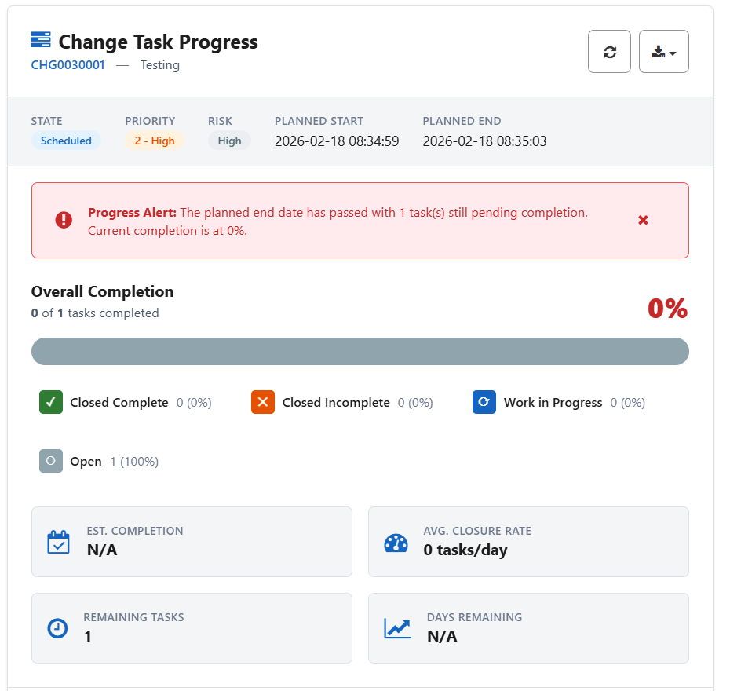

# Change Task Progress Widget

A production-ready **Change Task Progress** widget for the ServiceNow Service Portal. Provides real-time visibility into change task completion with an interactive progress dashboard, state breakdown, velocity metrics, threshold alerts, filtering, sorting, and CSV/PDF export.

---

## Features

- **Overall Completion Dashboard** — Color-coded progress bar (green/yellow/red) with percentage based on closed tasks
- **Interactive State Segments** — Clickable Closed Complete, Closed Incomplete, Work in Progress, and Open segments with drill-down filtering
- **Velocity Metrics** — Estimated completion date, average closure rate (tasks/day), remaining tasks, and days remaining
- **Threshold Alerts** — Configurable progress threshold with automatic alerts when completion is below target or planned end date is approaching/passed
- **Assignment Group Breakdown** — Workload distribution by group with task count and state-level breakdown
- **Advanced Filtering** — Filter by assignment group, priority, or state with one-click clear
- **Multi-Column Sorting** — Sortable columns for Number, Description, State, Priority, Group, and Assignee
- **CSV Export** — One-click export of filtered task data with change request metadata
- **PDF/Print Export** — Printable report with summary statistics and full task table
- **Auto-Refresh** — Configurable auto-refresh interval (default 60 seconds) with manual refresh button
- **Recently Closed Tasks** — Last 5 closed tasks with close code and assignee
- **Change Request Metadata** — State, priority, risk, planned start/end dates displayed in header
- **WCAG Accessible** — ARIA labels, keyboard navigation, focus indicators, screen reader support
- **Responsive Design** — Adapts from desktop to mobile with flexible layout breakpoints
- **CSS Custom Properties** — 30+ scoped design tokens for full theming support

---

## Tables Referenced

| Table | Purpose |
|-------|---------|
| `change_request` | Parent change request record |
| `change_task` | Implementation tasks linked to the change |
| `sys_user` | User display names (cached) |
| `sys_user_group` | Assignment group names (cached) |

---

## Tech Stack

- **AngularJS** — Service Portal widget framework
- **GlideRecord / GlideAggregate** — Server-side data queries with state aggregation
- **CSS Custom Properties** — 30+ scoped design tokens (`--ctp-*` namespace)
- **CSS Grid + Flexbox** — Responsive layout
- **spUtil** — ServiceNow Service Portal API for server calls

---

## Installation

1. Download `SNLab_change_task_progress.xml` from this folder.
2. In your ServiceNow instance, go to **System Update Sets > Retrieved Update Sets**.
3. Click **Import Update Set from XML** and upload the file.
4. **Preview** the update set — review any conflicts.
5. **Commit** the update set.
6. Navigate to your Service Portal and add the **Change Task Progress Widget** to a page.

### Post-Install

- Pass a change request `sys_id` via widget options (`change_sys_id`) or URL parameter (`?sys_id=...` or `?number=CHG...`).
- Configure optional widget options:
  - `threshold` — Completion percentage threshold for alerts (default: 50)
  - `auto_refresh` — Enable auto-refresh (default: false)
  - `refresh_interval` — Refresh interval in seconds (default: 60)

---

## What's Included

The update set contains:

- Service Portal widget (HTML template, client script, server script, CSS — ~2,540 lines)
- All functionality self-contained in a single widget

---

## Author

**iDevOpsLLC** | [YouTube - @AgenticServiceNow](https://www.youtube.com/@AgenticServiceNow)

## License

[MIT](../LICENSE)
