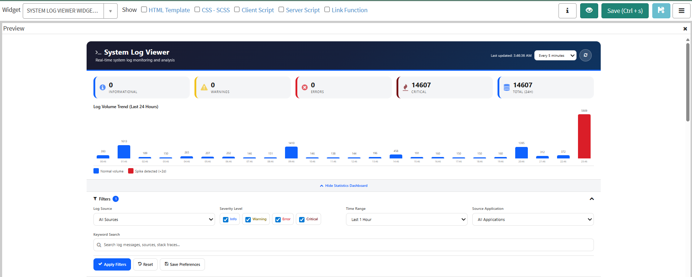

# System Log Viewer

A production-ready **System Log Viewer** widget for the ServiceNow Service Portal. Provides administrators with real-time system log monitoring and analysis including severity-based filtering, log volume trend visualization, keyword search, auto-refresh, CSV/JSON export, and configurable user preferences.

---

## Features

- **Real-Time Log Monitoring** - Live system log entries with auto-refresh intervals (30s, 1m, 2m, 5m, 10m) and manual refresh control
- **Statistics Dashboard** - At-a-glance severity counters for Informational, Warning, Error, and Critical entries with 24-hour totals
- **Log Volume Trend Chart** - Hourly bar chart of log volume over the last 24 hours with spike detection (>2 standard deviations highlighted in red)
- **Multi-Source Log Aggregation** - Query logs from System Log (syslog), Application Log (sys_log), Email Log (sys_email_log), and Events (sysevent)
- **Severity-Level Filtering** - Toggle checkboxes for Info, Warning, Error, and Critical severity levels with color-coded indicators
- **Time Range Selection** - Predefined ranges from 15 minutes to 7 days for quick log scoping
- **Source Application Filter** - Dropdown filter to isolate logs by originating application or module
- **Keyword Search** - Full-text search across log messages, sources, and stack traces
- **Collapsible Statistics Panel** - Show/hide the statistics dashboard and trend chart to maximize log viewing space
- **Collapsible Filter Panel** - Show/hide the filter controls with active filter count badge
- **CSV and JSON Export** - Export filtered log entries with severity, timestamp, source, and message fields
- **Clipboard Copy** - One-click copy of individual log entry details to clipboard
- **User Preference Persistence** - Save and restore filter settings, refresh interval, and panel states via localStorage
- **Pagination Controls** - Navigate large result sets with configurable page sizes (25, 50, 100, 200) and page navigation
- **Incident Creation** - Create incidents directly from critical or error log entries with pre-populated fields
- **Expandable Log Rows** - Click any log entry to reveal full message content and stack trace details
- **Responsive Layout** - CSS Grid design that adapts to various screen sizes and portal configurations
- **Accessibility** - WCAG 2.1 AA compliant with ARIA labels, keyboard navigation, and screen reader support

---

## Tables Referenced

| Table | Purpose |
|-------|---------|
| `syslog` | Primary system log entries and messages |
| `sys_log` | Application-level log entries |
| `sys_email_log` | Email transaction log records |
| `sysevent` | System event log entries |
| `incident` | Incident creation from critical log entries |

---

## Tech Stack

- **AngularJS** - Client-side controller with two-way data binding and digest-cycle management
- **GlideRecord / GlideAggregate** - Server-side log queries with role-based access control
- **CSS Variables** - Themed styling with dark/light mode support
- **CSS Grid** - Responsive layout for statistics cards, filters, and log table
- **Font Awesome** - Iconography for severity indicators, actions, and navigation
- **localStorage** - Client-side user preference persistence
- **Clipboard API** - One-click copy of log entry details
- **Visibility API** - Auto-pause refresh when the browser tab is inactive

---

## Installation

1. Download `SNLab_system_log_viewer.xml` from this folder.
2. In your ServiceNow instance, go to **System Update Sets > Retrieved Update Sets**.
3. Click **Import Update Set from XML** and upload the file.
4. **Preview** the update set - review any conflicts.
5. **Commit** the update set.
6. Navigate to your Service Portal and add the **System Log Viewer** widget to a page.

### Post-Install

- The widget reads system log tables that require **admin**, **itil**, **sn_admin**, **system_log_viewer**, or **security_admin** role access.
- Configure auto-refresh interval and default filters using the built-in preference controls.
- Use the Save Preferences button to persist your filter and display settings across sessions.

---

## What's Included

The update set contains:

- Service Portal widget (HTML template, client script, server script, CSS)
- Portal page configuration
- Severity-based color theme and responsive dashboard layout
- Statistics dashboard with 24-hour trend visualization

---

## Author

**iDevOpsLLC** | [YouTube - @AgenticServiceNow](https://www.youtube.com/@AgenticServiceNow)

## License

[MIT](../LICENSE)
