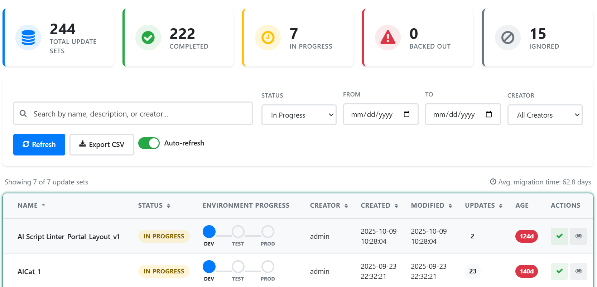

# Update Set Migration Tracker

A production-ready **Update Set Migration Tracker** widget for the ServiceNow Service Portal. Provides real-time visibility into update set migrations across your ServiceNow instance with a statistics dashboard, environment progress tracking, conflict detection, and CSV export.

---

## Features

- **Statistics Dashboard** — Clickable cards showing Total, Completed, In Progress, Backed Out, and Ignored counts
- **Real-Time Search** — Filter by name, description, or creator with instant results
- **Advanced Filtering** — Filter by status, date range, and creator with reset capability
- **Multi-Column Sorting** — Sortable columns for Name, Status, Creator, Created, Modified, and Updates
- **Environment Progress Tracking** — Visual DEV → TEST → PROD pipeline dots per update set
- **Conflict Detection** — Automatic detection and display of preview conflicts and warnings
- **Expandable Row Details** — Click any row to see XML contents, migration timeline, type summary, and conflicts
- **CSV Export** — One-click export of filtered update set data
- **Auto-Refresh** — Toggleable 60-second auto-refresh with live indicator
- **Server-Side Pagination** — 50 records per page with full pagination controls
- **Age Tracking** — Color-coded badges (green/yellow/red) based on update set age
- **Deployment Approval Requests** — Request approval workflow via system events
- **Role-Based Access Control** — Restricted to admin, maint, and update_set_installer roles
- **Type Summary Chips** — Visual breakdown of Business Rules, Client Scripts, etc. per update set
- **Migration Time Analytics** — Average migration time calculation across committed sets
- **WCAG Accessible** — Full ARIA labels, keyboard navigation, screen reader support
- **Responsive Design** — 4 breakpoints (1600px, 1024px, 768px, 480px)

---

## Tables Referenced

| Table | Purpose |
|-------|---------|
| `sys_update_set` | Local update sets |
| `sys_update_xml` | Update set XML contents |
| `sys_remote_update_set` | Retrieved/remote update sets |
| `sys_update_preview_problem` | Preview conflicts and warnings |
| `sys_user_has_role` | Role-based access check |

---

## Tech Stack

- **AngularJS** — Service Portal widget framework
- **GlideRecord / GlideAggregate** — Server-side data queries with pagination
- **CSS Grid + Flexbox** — Responsive layout with 4 breakpoints
- **CSS Custom Properties** — Full theming support (20+ design tokens)
- **spUtil / spModal** — ServiceNow Service Portal APIs for server calls and confirmations

---

## Installation

1. Download `SNLab_update_set_migration_tracker.xml` from this folder.
2. In your ServiceNow instance, go to **System Update Sets > Retrieved Update Sets**.
3. Click **Import Update Set from XML** and upload the file.
4. **Preview** the update set — review any conflicts.
5. **Commit** the update set.
6. Navigate to your Service Portal and add the **Update Set Migration Tracker** widget to a page.

### Post-Install

- Requires `admin`, `maint`, or `update_set_installer` role.
- Add the **Update Set Migration Tracker** widget to any Service Portal page.

---

## What's Included

The update set contains:

- Service Portal widget (HTML template, client script, server script, CSS — ~2,490 lines)
- All functionality self-contained in a single widget

---

## Author

**iDevOpsLLC** | [YouTube - @AgenticServiceNow](https://www.youtube.com/@AgenticServiceNow)

## License

[MIT](../LICENSE)
